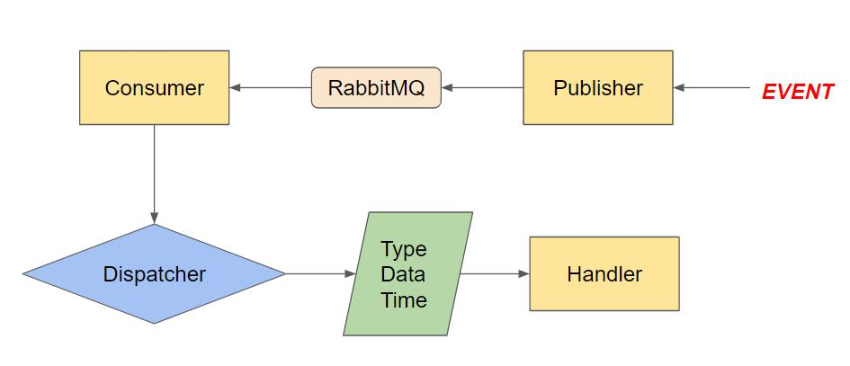

# RabbitMqPubSub
* 基礎環境建置
```
docker run -d --hostname rabbit1 --name myrabbit1 -p 15672:15672 -p 5672:5672 rabbitmq:3.7-management
```
* RabbitMqPubSub專案架構

    * 統一由Dispatcher(調度員)接收事件
    * 根據接收事件Type(EventName)，派發Handler